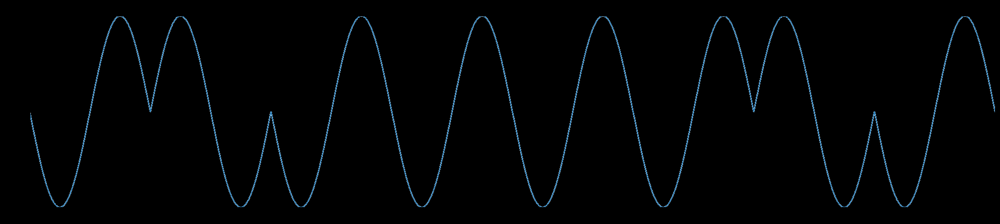

# Modulation Master

> Have you heard of digital modulation?
> I was forced to make this challenge.

## The challenge

We are given a site with a start button and then presented with the following instructions

> Identify the correct modulation type. Answer is always a single ASCII letter. If the binary sequence is 01001000, the answer will be 'H'.
> You have 2 seconds to answer each question once it is loaded.

Basically for each round we need to:
1. Determine the modulation type 
2. Find its binary representation
3. Convert it to ascii and submit it

We need to do all this in 2 seconds and then do this for 100 rounds

Obviously a human will not be able to do this so we need to code some browser automation that will decode and enter it for us

First thing is to decode the graphs

## Graph Processing

### The graphs

The graphs are given to us in the form of a blob image and they are one of 3 modulation types

The three modulation types are:

1. Amplitude Modulation

In this modulation for each segment the constant 0 represents 0, the wave part represents 1

2. Frequency Modulation

In this modulation a lower frequency represents 0, and higher frequency represents 1

3. Phase Modulation

Here the positive phase (sin) represents 1, while negative phase (-sin) represents 0

### Parsing the graphs

Since the graphs are given to us in an image file theres a lot of processing that needs to be done before we get the raw data

What we can do is first use OpenCV to load in the file in HSV and filter by blue colors. This lets us keep the blue data part of the graph and remove other stuff (axis, labels, ...)

Now we have an image like this:


Now with this our life gets easier, because to extract the data we just look into each column and grab the row with the highest blue color, giving us an array of the raw data values

### Decoding the graphs

Next we split the graphs into 8 segments for each bit and apply fft (Fast Fourier Transform) so that we can extract the frequency and phase data 

The [Fast Fourier Transform](https://en.wikipedia.org/wiki/Fast_Fourier_transform) essentially transforms our raw data in each segment such that the complex value in each index corresponds to its magnitude and phase for the frequency represented by that index.

In our case, for an array with a single sinusoid we can expect to find one (technically 2 but its whatever) value in the array with a very high magnitude with its index representing the frequency for such a sinusoid. Using this we can find the approximate frequency and phase(the angle of the complex value) that represents the sinusoid in each segment of the graph.

From this we get a frequency and phase value for each segment which we can analyze to determine the modulation and decode it

1. Amplitude Modulation - We expect the the frequency list to contain 2 distinct values, a low value (about 0) for the constant part, and a higher value for the wave part

2. Frequency Modulation - Similar to 1. there should be 2 values, one for a lower frequency representing 0 bit, and a higher frequency for a 1 bit

3. Phase Modulation - In this case we should see that the frequency should contain almost all the same values, but the phase should contain values for -pi and pi representing a positive and negative phase shift from cos(x). We can map these phase shifts to the bit values, pos for 1 bit, neg for 0 bit.

Applying the above we get our binary string that we can then convert to a char which is the answer


## Browser Automation

Now we just need to write a script that will:
1. Open the website
2. Click start
3. Get the image of the graph
4. Run it through the above stuff and get the letter representation
5. Enter it into the box and click submit
6. Go to 3. and repeat until we get to lvl 100

This is pretty simple, we can use `selenium` for our browser automation which will do all the above for us

## Final Solution 

```python
from scipy.fft import rfft, rfftfreq
import cv2
import numpy as np
import matplotlib.pyplot as plt
from selenium import webdriver
from selenium.webdriver.common.by import By
from selenium.webdriver.support import expected_conditions as EC
from selenium.webdriver.support.ui import WebDriverWait
import time
import os
import sys

# Returns the frequency and phase of the largest value in the fft
def estimate_phase_polarity(segment):
    y = segment - np.mean(segment)
    n = len(y)
    yf = rfft(y)
    xf = rfftfreq(n, d=1)

    idx = np.argmax(np.abs(yf[1:])) + 1  # strongest freq index
    freq = xf[idx]
    phase = np.angle(yf[idx])

    return freq, phase

# Given the image path i returns the letter associated with the waveform
def get_letter(i):

    # Load in image convert to hsv
    img = cv2.imread(i)
    hsv = cv2.cvtColor(img, cv2.COLOR_BGR2HSV)

    # Define blue range — adjust if needed
    lower_blue = np.array([70, 25, 25])   # lower hue for blue
    upper_blue = np.array([140, 255, 255])  # upper hue for blue

    # Isolate the blue colors
    mask = cv2.inRange(hsv, lower_blue, upper_blue)
    isolated = cv2.bitwise_and(img, img, mask=mask)
    img = isolated
    cv2.imwrite("blue.png", img)

    height, width, _ = img.shape
    wave_y = []
    x_coords = []

    # For each column get the brightest pixel
    for x in range(width):
        column = img[:, x]
        if np.any(column > 0):
            y = np.argmax(column)
            wave_y.append(y)
            x_coords.append(x)

    wave_y = np.array(wave_y)
    x_coords = np.array(x_coords)

    # Split into segments of 8
    length = len(wave_y)
    segment_size = length // 8
    segments = [wave_y[i*segment_size : (i+1)*segment_size] for i in range(8)]
    freqs, phases = zip(*[estimate_phase_polarity(s) for s in segments])
    freqs = np.array(freqs)
    phases = np.array(phases)

    print(freqs)
    print(phases)

    all_same_freq = np.allclose(freqs, freqs[0], rtol=1e-3, atol=1e-3)

    bits = []
    
    #Compare frequencies low = 0, high = 1
    if (not all_same_freq):
        threshold = (freqs.min() + freqs.max()) / 2
        bits = (freqs > threshold).astype(int)
    else:
        # Compare phase pos = 1, neg = 0
        bits = (phases > 0).astype(int)

    print(bits)

    # Convert to char
    char = chr(int(''.join(map(str, bits)), 2))
    print(char)

    return char

# selenium automation
driver = webdriver.Chrome()
driver.get(sys.argv[1])
wait = WebDriverWait(driver, 10)

# Click start once
wait.until(EC.element_to_be_clickable((By.ID, "start"))).click()

for i in range(200):
    try:
        print(f"\n--- Round {i + 1}/100 ---")

        # Re-locate elements fresh each round (important!)
        img_el = wait.until(EC.presence_of_element_located((By.ID, "textImage")))
        input_el = wait.until(EC.presence_of_element_located((By.ID, "answer")))
        submit_el = wait.until(EC.element_to_be_clickable((By.ID, "submit")))

        # Wait for image to fully load
        wait.until(lambda d: d.execute_script(
            "return document.getElementById('textImage').complete && "
            "document.getElementById('textImage').naturalWidth > 0"
        ))

        time.sleep(0.2)

        # Screenshot
        img_el.screenshot("wave.png")

        # Decode letter
        decoded_char = get_letter("wave.png")

        # Input and submit
        input_el.clear()
        input_el.send_keys(decoded_char)
        submit_el.click()


    except Exception as e:
        print(f"Round {i + 1} failed: {e}")

driver.quit()
```

The `get_letter` function essentially takes in our screenshot of the graph, applies the blue filter, and converts into an array of raw data. Then it uses the fft to extract frequency/phase for each segment. We then process the segments data and extract the bit components returning the letter

For the selenium part we load up the site, hit start, and then wait for everything to load including the graph. Then take a screenshot of the graph (cause its a blob this is easiest) and then send it to our function. Input the answer and move on

Once we get to lvl 100 with less than 10 wrong answers the website gives us our flag: `osu{I_h0p3_y0u_d1dn't_u53_LLM_2_s0Lv3_7H1S}`

It actually took me a while even after I wrote a working solution because it kept disconnecting me, but after the challenge was moved to the instancer I was able to get this at almost 3 am for the first time:

