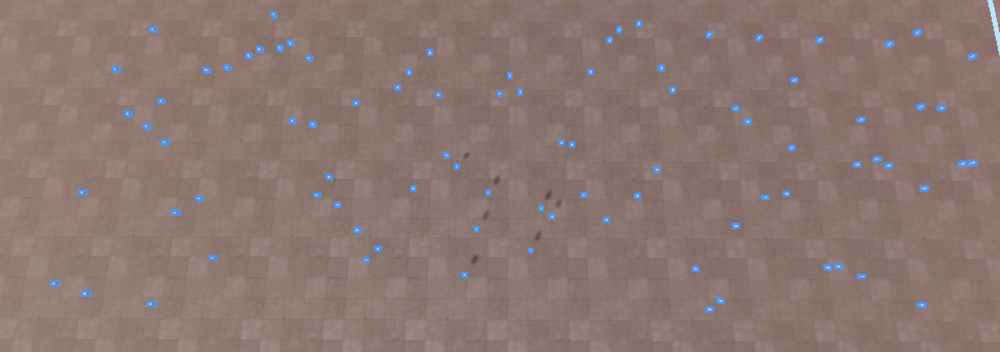

# rorecovery3

> an old builder left this behind seems like his girlfriend threw his computer out the window too. everything at LEAST seems randomly placed... until you LOOK closer.

*I wasn't able to complete this problem during the CTF but I was pretty close, so I decided to still write a writeup for this challenge*

## Files

Only one file this time called `leastsaneblueprint`

## File Recovery

This process is similar to the other rorecovery challenges but I will include the process here since I don't feel like making writeups for those

Running `file leastsaneblueprint` just gives us `data` so lets look at the hexdump for this file

```
xxd leastsaneblueprint | head

00000000: 3c72 626c 7821 25ff 0d0a 150a 0000 7700  <rblx!%.......w.
00000010: 0000 5f9d 0000 0000 0000 0000 0000 5353  .._...........SS
00000020: 5452 30fe 9300 ffc4 f100 0000 0000 6000  TR0...........`.
00000030: 0000 009c 0406 000f 0200 0fa0 0f00 0000  ................
00000040: 4353 4750 4853 3600 5c42 4c4f 434b 3500  CSGPHS6.\BLOCK5.
00000050: 243b 6f23 00fc 1f07 0000 0002 9edb 4744  $;o#..........GD
00000060: 94c7 b23d 0513 493e 0fed f53b ddd6 2548  ...=..I>...;..%H
00000070: e622 08c2 003d 1ebf e5f5 6647 004d 5642  ."...=....fG.MVB
00000080: acc0 d847 1048 003e 0000 0014 00f7 0b80  ...G.H.>........
00000090: 3f2a 0000 0004 0000 00c9 3409 3dce f62a  ?*........4.=..*
```

```
xxd leastsaneblueprint | tail

00a923b0: 0078 7d03 0f02 0000 2103 01be 4951 0001  .x}.....!...IQ..
00a923c0: 003d 521f 00f1 0001 004f 6261 016a 0001  .=R......Oba.j..
00a923d0: 6772 016f 017c fe03 9109 0000 0001 1817  gr.o.|..........
00a923e0: 7771 2200 2400 0083 00f4 1913 2600 0600  wq".$.......&...
00a923f0: 0005 0025 0000 0042 0006 0501 0c00 0605  ...%...B........
00a92400: 0b16 0006 0515 0101 003b 0066 0163 0000  .........;.f.c..
00a92410: 0000 7238 0001 0200 618e 8d00 0000 980b  ..r8....a.......
00a92420: 0011 9706 0080 0000 0000 0000 0000 454e  ..............EN
00a92430: 4400 0000 0000 0900 0000 0000 3c2f 7262  D...........</rb
00a92440: 6c78 3e                                  lx>
```

Looking at the `rblx` and doing some googling we can assume these are supposed to be roblox files

We can find a nice format specification [here](https://dom.rojo.space/binary.html)

According to the specifications the file header must be `<roblox!` followed by `89 ff 0d 1a 0a` in hex and must end in `</roblox>`

Now we just open the file in a hex editor and fix it up, we also have to add 2 null bytes at the end or else roblox studio gets mad that it isnt the right size or something

Now we are able to open the file in Roblox Studio

## Finding the flag

Opening the file we are faced with a city template and we need to find things that are "randomly placed"

The buildings are the same as the template file but if we keep looking around we find these pipes sticking out randomly



The pipes itself don't seem to make any pattern but if we look at the coordinates we can see the z coordinates are all equally spaced while the x coordinates vary

With a little help from roblox's built in ai assistant we can get a lua script that grabs all the x coordinates

```lua
local pipesFolder = workspace:FindFirstChild("Endorsed Models"):FindFirstChild("Streets"):FindFirstChild("CityPiping")
local xCoordinates = {}

if pipesFolder then
    for i = 1, 248 do
        local pipe = pipesFolder:FindFirstChild("Pipe_" .. i)
        if pipe then
            local x = pipe.Position.X
            table.insert(xCoordinates, x)
        end
    end
end
print("X Coordinates of Pipes:", table.concat(xCoordinates, ", "))
```

## Decoding

This is where I got stuck, but if you look at the title of the file **l**east**s**ane**b**lueprint and **LEAST** in the description we come to the conclusion that we need to use lsb (Least Significant Byte) decoding

Now we just write a python script to take in these coordinates and get our decrypted flag

```python
import struct
xlist = [18.895000457763672, 43.96900177001953, 81.1259994506836, 16.208999633789062, 67.23600006103516, 94.1449966430664, 63.46799850463867, 71.24600219726562, 58.680999755859375, 13.586999893188477, 38.32600021362305, 80.88300323486328, 42.39799880981445, 81.77400207519531, 26.011999130249023, 85.62999725341797, 87.66000366210938, 99.1510009765625, 88.1760025024414, 89.73300170898438, 65.33100128173828, 84.95099639892578, 64.23899841308594, 43.41999816894531, 48.62699890136719, 40.70800018310547, 70.8030014038086, 33.6609992980957, 25.558000564575195, 28.485000610351562, 75.70600128173828, 80.47699737548828, 45.51300048828125, 86.80799865722656, 73.43000030517578, 55.097999572753906, 51.96699905395508, 21.509000778198242, 34.020999908447266, 44.41400146484375, 73.91200256347656, 79.60199737548828, 74.41699981689453, 28.22599983215332, 40.00699996948242, 37.62799835205078, 58.979000091552734, 58.53300094604492, 43.79199981689453, 80.89099884033203, 36.729000091552734, 91.1500015258789, 94.61799621582031, 43.56700134277344, 96.58499908447266, 51.012001037597656, 82.15499877929688, 75.2490005493164, 23.365999221801758, 12.642999649047852, 15.045000076293945, 93.00399780273438, 35.15800094604492, 69.52799987792969, 65.50599670410156, 43.27399826049805, 92.00800323486328, 44.314998626708984, 57.7859992980957, 78.41000366210938, 23.93199920654297, 24.20800018310547, 91.27799987792969, 21.5049991607666, 52.7400016784668, 66.20899963378906, 54.50899887084961, 52.54600143432617, 14.10099983215332, 90.16400146484375, 45.974998474121094, 70.24199676513672, 93.91000366210938, 69.81800079345703, 53.132999420166016, 53.4109992980957, 18.517000198364258, 86.18599700927734, 27.264999389648438, 10.262999534606934, 21.759000778198242, 25.30299949645996, 51.72200012207031, 21.270000457763672, 65.26399993896484, 23.594999313354492, 48.06700134277344, 50.0890007019043, 83.75299835205078, 22.00200080871582, 85.32099914550781, 10.175999641418457, 92.10099792480469, 79.49299621582031, 24.819000244140625, 18.832000732421875, 46.05099868774414, 30.36400032043457, 65.35600280761719, 52.19300079345703, 14.571999549865723, 80.31600189208984, 24.298999786376953, 62.22700119018555, 55.92100143432617, 48.21099853515625, 66.81500244140625, 77.85900115966797, 57.15800094604492, 50.48099899291992, 22.95199966430664, 71.91500091552734, 10.340999603271484, 53.242000579833984, 34.49300003051758, 53.9379997253418, 38.60499954223633, 23.5939998626709, 86.82099914550781, 98.74600219726562, 98.65799713134766, 41.04600143432617, 98.79499816894531, 19.695999145507812, 84.58000183105469, 28.996999740600586, 22.81100082397461, 10.62600040435791, 37.0620002746582, 72.91699981689453, 13.95199966430664, 33, 41.6609992980957, 92.67400360107422, 48.91600036621094, 53.702999114990234, 81.97000122070312, 81.4020004272461, 57.1349983215332, 85.70099639892578, 57.132999420166016, 80.41699981689453, 80.21499633789062, 16.52400016784668, 64.04399871826172, 22.29400062561035, 44.99800109863281, 84.7699966430664, 55.25199890136719, 32.38800048828125, 15.642999649047852, 93.9749984741211, 86.0770034790039, 56.42499923706055, 89.2030029296875, 26.195999145507812, 77.3479995727539, 69.75499725341797, 28.145000457763672, 52.12099838256836, 34.08399963378906, 39.32400131225586, 69.66500091552734, 85.78800201416016, 51.65800094604492, 16.37700080871582, 49.56800079345703, 99.93599700927734, 47.676998138427734, 34.643001556396484, 90.43800354003906, 80.98100280761719, 31.155000686645508, 55.178001403808594, 52.821998596191406, 71.17500305175781, 84.43000030517578, 58.34199905395508, 92.13099670410156, 42.097999572753906, 56.9630012512207, 87.26599884033203, 85.4219970703125, 44.827999114990234, 60.95199966430664, 39.959999084472656, 65.23699951171875, 59.374000549316406, 45.790000915527344, 53.07600021362305, 26.59000015258789, 68.85700225830078, 83.3219985961914, 14.812000274658203, 15.95300006866455, 47.270999908447266, 26.714000701904297, 44.470001220703125, 73.13600158691406, 54.222999572753906, 50.88199996948242, 66.72699737548828, 55.20000076293945, 14.03600025177002, 74.55699920654297, 71.47899627685547, 73.97599792480469, 84.72100067138672, 95.62200164794922, 32.492000579833984, 56.770999908447266, 97.18599700927734, 22.854999542236328, 69.14800262451172, 17.312999725341797, 70.80899810791016, 74.10800170898438, 39.2760009765625, 64.16600036621094, 88.61499786376953, 37.250999450683594, 74.79900360107422, 15.003000259399414, 73.20600128173828, 30.479999542236328, 30.679000854492188, 76.14800262451172, 71.28800201416016, 77.59400177001953, 82.54000091552734, 87.00599670410156, 83.0270004272461, 20.117000579833984, 19.44300079345703, 84.7760009765625, 18.038000106811523, 24.767000198364258, 44.37300109863281]

def float_lsb_bitstream(data):
    bitstream = ''
    for x in data:
        b = struct.unpack('<I', struct.pack('<f', x))[0]
        bitstream += str(b & 1)
    return bitstream

def bitstream_to_string(bitstream):
    chars = []
    for i in range(0, len(bitstream), 8):
        byte = bitstream[i:i+8]
        if len(byte) < 8:
            break
        c = chr(int(byte, 2))
        if c == '\x00':
            break
        chars.append(c)
    return ''.join(chars)

bitstream = float_lsb_bitstream(xlist)
message = bitstream_to_string(bitstream)
print(message)
```

This gives us the flag `.;,;.{rbxl_st3g_1s_ts_r3al?}` yippee
